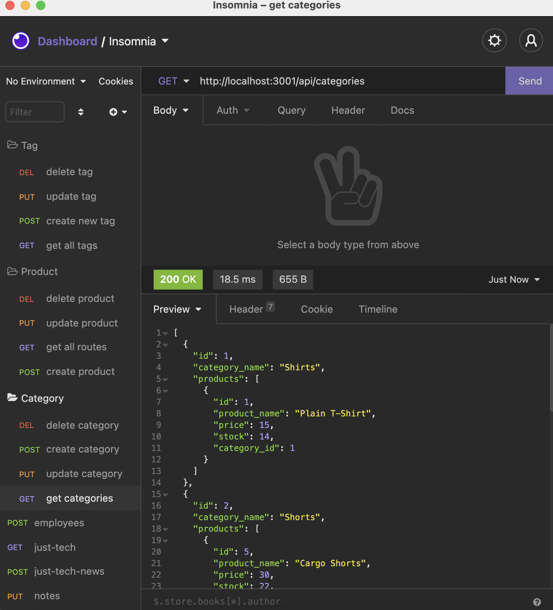

# e-commerce

## Description 
e-commerce is a back end site. Takes a working Express.js API and Sequelize with a MYSQL database. 



### Full Movie
[movie](v)

## User Story

```md
AS A manager at an internet retail company
I WANT a back end for my e-commerce website that uses the latest technologies
SO THAT my company can compete with other e-commerce companies
```

## Acceptance Criteria

```md
GIVEN a functional Express.js API
WHEN I add my database name, MySQL username, and MySQL password to an environment variable file
THEN I am able to connect to a database using Sequelize
WHEN I enter schema and seed commands
THEN a development database is created and is seeded with test data
WHEN I enter the command to invoke the application
THEN my server is started and the Sequelize models are synced to the MySQL database
WHEN I open API GET routes in Insomnia Core for categories, products, or tags
THEN the data for each of these routes is displayed in a formatted JSON
WHEN I test API POST, PUT, and DELETE routes in Insomnia Core
THEN I am able to successfully create, update, and delete data in my database
```


## Table of Contents (Optional)

If your README is very long, add a table of contents to make it easy for users to find what they need.

* [Installation](#installation)
* [Usage](#usage)
* [Credits](#credits)
* [License](#license)


## Installation

`npm i mysql` >
`npm i sequelize` >
`npm i dotenv`


## Usage 

To use the 
1. Open the terminal 
2. Run `npm start`
3. Open Insomnia 
4. Run the different URL request for GET, POST, PUT, DELETE with the respective end points. 


---

🏆 
## Badges


## Contributing / Credits

[mariamv29](https://github.com/mariamv29/README-generator.git)